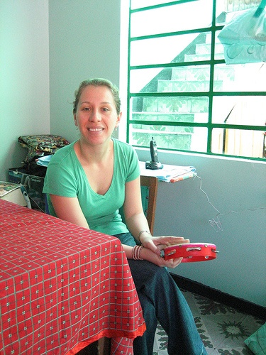
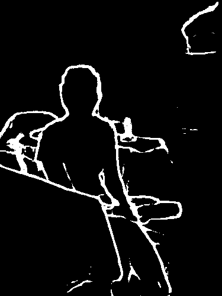

# Contour-Detection-Pytorch
In this work I replicate the [Object Contour Detection with a Fully Convolutional Encoder-Decoder Network](https://arxiv.org/pdf/1603.04530.pdf). The model,data augmentation and training details remain exactly as mentioned in the paper.

## Dataset
The dataset used is PASCAL-2012 , I have used the train set for training and val set for testing as done in the paper. We use DenseCRF refined segmentation maps as the raw labels. These maps are then processed using a 3-3 mask morphing mask to turn them into counter detection target. 

|*Orignal Image* | *Segmantation map* | *Processed label* |
|----------------|--------------------| -----------------|
| |  |  |

```
Run the file extract_contours.py to convert the provided segmentation maps into processed labels. (labels stored in the folder "improved contours" )
```

### Data augmentation
I perform the same augmentations as mentioned in the paper.  
1) Random crop (224*224)
2) Color jitter (from transforms in pytorch)
3) Horizontal flip

## Model
The model used a pretrained vgg-16 network as encoder, a symmetric light weight decoder. During training only the decoder is trained as mentioned in the paper. The decoder makes use of unpooling layers to upsample, each unpooling layer recives corrosponding indices from the relevant pooling layer in the decoder.


## Training details
I use mini-batch size of 8, that is a single image randomly cropped four times and then flipped horizontally and cropped four times. A total of 10,383 training examples from the PASCAL datast have been used. The model is traning for 30 epochs , each epoch goes over all images once. The learning rate is fixed at 1e-4. Optimizer used is Adam.

The problem is treated as pixel classification problem , where the contour pixels are labeled as 1 and non contour pixels as 0. BCE loss is used to train the model. As the number of non contour pixels far surpasses the contour ones, the loss weight for contour pixels is 10 times that of their counterpart.

### Multi-Processing (making dataloading parallel)
One of the biggest problems faced in this work is the slow speed of data streaming from google drive. As training was done on google colab, many disc seeks were made on google drive. If this goes on in a blocking way the speed benifit offered by GPUs will not be utilized to the maximium.  
To counter this I have used multiprocessing to run several dataloaders in parallel, they take up the data from google drive(or your PC) and then put it into a thread/process safe Queue , the data from the queue is poped one by one and fed to the trainer object that uses it to train the model.  
So tldr...  
1) Many workers (each worker is slow) fills up the queue from one side.
2) The model (that is fast) removes the data placed in the queue from the other side.  

```
For more implementation details ,memory management and queue size control refer to train.py

```

## Results
We have achived f1 score of 50% , compared to 57% of the paper.

### Examples

| *Orignal image* | *Extracted_contour* |
|-----------------|---------------------|
| | |


## How to run 
### Training
1) Clone the project.
2) Download the train images from [this link](https://drive.google.com/drive/folders/1UtoI52NtRX_-UHq3mwVeTnVhhXP6Tv0T?usp=sharing). And place them in the *JPEGimages* folder
3) Download the DenseCRF refined segmantation maps for PASCAL-2012 dataset. And place them in *SegmentationObjectFilledDenseCRF* folder.
4) Run the *extract_contours.py* file to process the segmentation maps into countour labels. Or you can just download my preprocessed labels from [here](https://drive.google.com/drive/folders/12B89J4aQ3n1nghNhXBNUowNP0smfzISe?usp=sharing) and place them in *improved_contours* folder
5) Run *train.py* file to train the model on train data for 30 epochs.Note that it will save model after each epoch and place it in *models* folder.


### Evaluation
To evaluate any model , follow the following steps.

1) Run *make_results.py* with model name you want to evaluate as the first and only command line argument.
``` 
This will run all the images in the validation set in their orignal sizes thorugh the model and save the output in results folder in .npy format
```
2) After results are made run *Eval.py* , this will output the P-R curve for the model and print the best threshold and corrosponding f1 score on the console. 


## Try it yourself !!!!
I have provided *ContourDetector.py* , running this file is simple, like so...  
```
python Contourdetector.py path_to_your_rgb_channeled_image  
```
Running this with pass you image through the **best model** that I have obtained, using the best threshold, and display the extracted countours on your screen !!!.  
Have fun.
